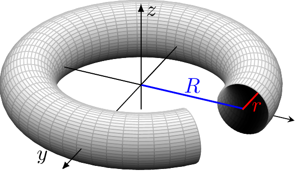
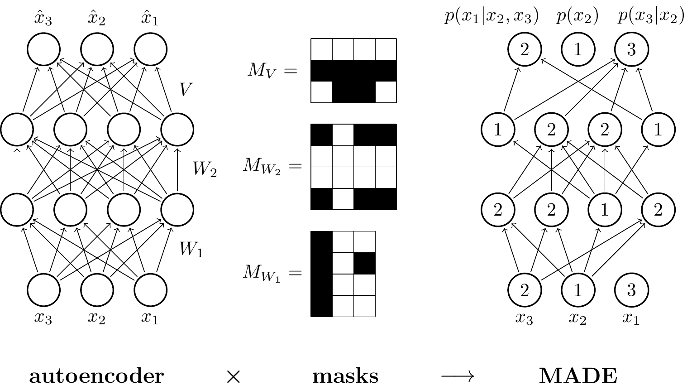
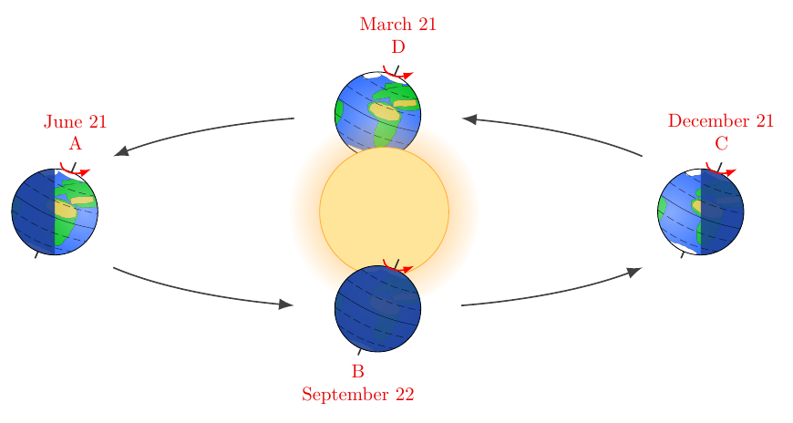

# TikZ Renderer

A lightweight Flask server that compiles TikZ (LaTeX) code into PNG or PDF images. Designed to run server-side for projects that require rendering high-quality diagrams from TikZ - something not easily achieved in the browser using JavaScript.

---

## ✨ Features

- **TikZ Compilation**: Accepts TikZ code and compiles it using `tectonic`.
- **PNG or PDF Output**: Returns a clean, cropped PNG image or the original PDF.
- **Smart Whitespace Trimming**: Automatically trims excessive white space based on pixel analysis.
- **Simple API**: POST an endpoint with TikZ, get an image back—ready to integrate.

---

## 🖼 Examples

Here are a few advanced TikZ diagrams rendered using this server.
See [`examples/`](examples/) for source `.tex` code and output images. All credit for these goes to the talented authors.

| Diagram             | Author             | Preview |
|---------------------|--------------------|---------|
| Torus  | Janosh Riebesell            |  |
| Masked Autoencoder  | Mathieu Germain, Karol Gregor, et al.   |  |
| Orbit Diagram       | Izaak Neutelings   |  |

---

## 📁 Project Structure

```
├── app.py              # Flask API server
├── utils.py            # Compilation, cropping, and image conversion logic
├── requirements.txt    # Python dependencies
├── .gitignore
├── LICENSE             # License information
├── README.md           # Project documentation
````

---

## 📦 Requirements

- Python 3.7+
- [Tectonic](https://tectonic-typesetting.github.io/) (LaTeX compiler)
- [Poppler](https://poppler.freedesktop.org/) (for `pdftoppm`, used by `pdf2image`)
- Python packages:

```bash
pip install -r requirements.txt
````

To install system dependencies (on Ubuntu):

```bash
sudo apt install poppler-utils
```

To install Tectonic:

```bash
curl --proto '=https' --tlsv1.2 -sSf https://drop.crates.io | bash
```

Or see [https://tectonic-typesetting.github.io/en-US/install/](https://tectonic-typesetting.github.io/en-US/install/)

---

## 🚀 Usage

### 1. Run the Server

```bash
python app.py
```

### 2. Send a POST request

#### Endpoint

```
POST /compile
```

#### Body (JSON)

```json
{
  "tikz_code": "\\begin{tikzpicture}\\draw (0,0) -- (1,1);\\end{tikzpicture}",
  "format": "png"
}
```

* `tikz_code` (required): Raw TikZ code.
* `format` (optional): `"png"` or `"pdf"` (default is `"png"`).

#### Example using `curl`

```bash
curl -X POST http://localhost:5000/compile \
     -H "Content-Type: application/json" \
     -d '{"tikz_code": "\\begin{tikzpicture}\\draw (0,0) -- (1,1);\\end{tikzpicture}"}' \
     --output output.png
```

### 📝 TikZ Code Formatting Notes

When sending TikZ code in the JSON body, it must be properly escaped:

- Replace each newline with \n
- Escape every backslash (\) as \\

✅ Example
This TikZ code:
```latex
\begin{tikzpicture}
  \draw (0,0) -- (1,1);
\end{tikzpicture}
```
Must be formatted like this in JSON:
```json
{
  "tikz_code": "\\begin{tikzpicture}\\n  \\draw (0,0) -- (1,1);\\n\\end{tikzpicture}"
}
```

> ⚠️ Most programming languages (like Python, JS, etc.) have utilities for properly escaping multi-line strings for JSON. Avoid doing this by hand unless it's simple.

---

## 🧠 How It Works

1. TikZ code is embedded into a minimal LaTeX document.
2. Tectonic compiles the document into a PDF.
3. If `png` is requested:

   * The PDF is converted to an image.
   * Smart cropping removes extra white space using pixel intensity checks.
4. The image is returned to the client.

---

## ⚠️ Notes

* TikZ code is executed server-side—**never expose this service publicly without sanitisation**, as LaTeX execution can be dangerous.
* Temporary files are created in a secure temp directory and auto-cleaned.

---

## 📜 License

MIT License

## 🙏 Acknowledgments

Special thanks to the amazing TikZ community and contributors to resources like [TikZ.net](https://tikz.net) and [TeXample.net](http://www.texample.net/). These platforms have been invaluable for inspiration, examples, and guidance, and continue to showcase the power of LaTeX graphics through TikZ.

---

Made with ❤️ by Reuben McQueen at [OpenKit](https://openkit.co.uk)
